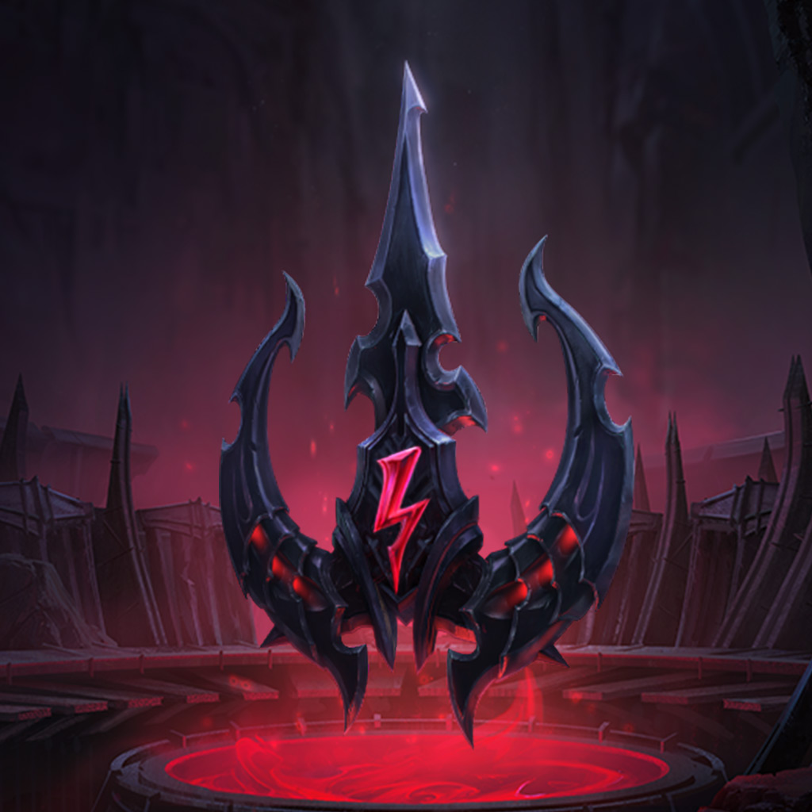

Runemaster
====

A Discord bot for League of Legends

### installation

1. `pip install requirements`
2. `python bot/runemaster.py`

### Requirements

- Python 3.6+
- Selenium 
- requests
- [riotwatcher](https://github.com/pseudonym117/Riot-Watcher)

### Driver & Bin

*Make sure Driver and bin are compatible*
- Linux (this bot runs on driver v84.0.4147.30, and chrome bin v84.0.4147.89): 
    - Chrome Binary 
    - Chrome Driver
- Windows:
    - Firefox Binary
    - Gecko Driver

## Commands

*All commands start with a* `>` *and most commands will require an argument, usually this will be the name of a champion. If the champ has a* **space** *or a* **singlequote** *dont include them in the name. ex: DrMundo, Reksai, Kaisa*

#### Info

- <kbd>>hello</kbd>: RuneMaster greets you!
- <kbd>>commands</kbd>: Returns a list of all the commands
- <kbd>>help *</kbd>: Returns a tooltip with the usage on a specific command `>help info`
- <kbd>>reload</kbd>: Reloads the RuneMaster Bot, use this command if you notice that the bot is going slow and has popups in messages.
- <kbd>>tierlist | tiers</kbd>: Returns an image of the current up to date ranked tier list
- <kbd>>oldtierlist | oldtiers</kbd>: Returns an image of the old outdated ranked tier list
- <kbd>>tier *</kbd>: Returns an image of the tier rank specified `>tier gold`
- <kbd>>regions</kbd>: Returns a list of all regions that you can use to look up 

#### Player

*all of these commands take the name of a player as an arguement(input)* **`>summon KR hideonbush`** 

- <kbd>>summon *</kbd>: Returns information on a Summoner like they're level, rank, player icon. Default region is NA, don't include a region if you just want NA
- <kbd>>history *</kbd>: Returns an image of the last 5 games in the players match history 

#### Champion

*all of these commands take the name of a champion as an arguement(input)* **`>info Aatrox`**

- <kbd>>info *</kbd>: Returns detailed information on a Champion, including description, stats, image
- <kbd>>runes *</kbd>: Returns an image of the highest win-rate Runes on that champion
- <kbd>>build *</kbd>: Returns an image of the highest win-rate Build on that champion
- <kbd>>skills *</kbd>: Returns an image of the highest win-rate Skill order on that champion
- <kbd>>stats *</kbd>: Returns an image of all the stats for that champion
- <kbd>>sums *</kbd>: Returns an image of the highest win-rate Summoner Spells on that champion
- <kbd>>matchups *</kbd>: Returns an image of the best and worst matchups on that champion